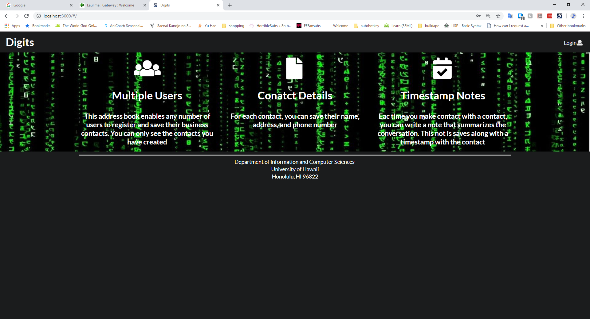

# Digits

Digits is an application that allows users to:
* Register an account
* Create and manage a set of contacts
* Add a set of timestamped notes regarding their conversation with each contact

**Installation**

First, would you so kindly [install Meteor](https://www.meteor.com/install).

Second, [download a copy of the application](https://github.com/japhet-ye/digits). 
Please note that this is a private repo. Please contact me to gain access to the source code.
I will be checking everyone who wants a piece of this action. Or alternatively is somehow
there just so happens to be a sizeable "donation" then I might consider. 

After you have done either of the above, via the terminal, change into the app directory
to install the required libraries via:

 After that is finished, you can run the application by invoking:
 
 
 
 The first time you start, it will be very slow. So go play solitaire or something to
 pass the time. After about your second or third game (if you are good), you should be 
 greeted with this:
 
 
 
 **Note about that bcrypt warning**: The following might follow:
 
  
 
 Do not worry. Bcryot used for password checking in Meteor. This application does not
 implement bcrypt in its current state.
 
 If you did it correctly, you can run an eslint check for all the files and directories 
 by invoking:
 
 
 
 To access the application you will need to go to your browser and do to 
 [http://localhost:3000](http://localhost:3000). You can login by looking at the login
 credentials of default accounts in the settings.development.json file in the config 
 directory.
 
#User Interface Walkthrough
 **Landing Page**
 
 When you first reach the application, you are greeted with the Landing Page of Digits,
 which provides a brief overview of the application and it's capabilities
 
  
 
 **Register**
 
 If you do not have an account, you can register for one by clicking the "Login" button 
 on the top right of the screen, then pressing "Sign Up" from the drop down menu.
 
  

**Sign in**
If you already have an account, you will go to the Login page via the "Login" button on
the top right of the screen. The link will take you to this page where you can
enter your credentials to login:

 

**User home page**

After logging in. You are taken to the home page with two new tabs available to you.
The "Add Contact" and "List Contacts" tabs are located in the Navbar:

**List Contacts**

This tab allows you to see all the contacts associated with the logged in user:

 

This tab also allows you to add timestamped "notes" about a recent interactions with said
contact. Example:

 
 
**Edit Contacts**

From the List Contacts page, you can click the "Edit" associated with the contact to edit 
information about the contact: 
 
 
 
**Admin Mode**

Admins have the POWER to see all the contacts for all of the users via the special 
"Admin" button in the Navbar. It is possible to add more admins through the
settings.development.json file and modifying the users method.
 
  